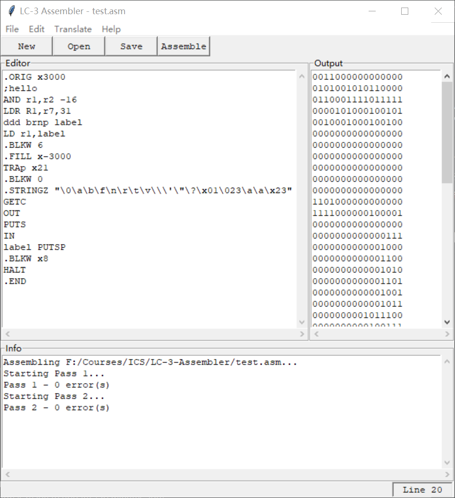
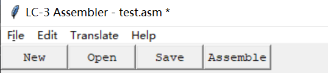

# LC-3 汇编器

这是一个LC-3汇编器的实现，包括汇编程序`assemble.py`和一个用python
内置GUI库`tkinter`实现的图形界面的编辑器`interface.py`.

## 例子

## 使用
没有使用到非python内置的库，将程序下载到本地运行即可，可能需要改动一些路径。`test`文件夹中包含一些简单的例子可供使用。
另外，图形界面可能会存在一些`bug`，但是基本的使用是没有问题的。

## 功能
主要功能当然是实现对一个LC-3汇编语言程序进行汇编，输出机器码文件，见上面的[例子](#例子)，当然其中包括错误
信息的处理。但实际上，因为第一次用`tkinter`这个库，实现图形界面的编辑器花了我更多的时间，所以也想介绍一下这个编辑器主要的功能：
* 编辑功能，文件导入功能。
* 基本的编辑器快捷键，如Ctrl+N(New)/O(Open)/S(Save)/Z(Undo)/Y(Redo)/C/X/V，以及汇编快捷键Ctrl+Enter。
* 未保存文件标记，即右上角标记星号`*`。
    
* 行数显示。
* 还算美观的界面(tkinter太丑了，而且元素布局不大好控制，可能是我没学会吧)

## 主要困难
在实现汇编程序的过程中最麻烦的是处理错误信息。不仅是因为错误信息多种多样
而且官方给出的LC-3编辑器在汇编过程中的报错信息难以捉摸，很多地方和书上介
绍的不太一样。为了简化错误处理，我是逐行进行汇编的。而在官方给出的编辑器里
把整个程序任意分行或者是全部写在同一行都是可以汇编出正确结果的。

下面列出了汇编过程中遇到的主要的困难：
* 操作数之间可以用逗号分隔也可以用空白字符如空格制表符等。
* 不区分大小写，`R7/r7`,`adD/ADD`都是一样的(不过这个比较容易处理)，label除外。
* offset可以是二进制十进制十六进制，`b01111, 15, #15, x0f`都是一样的。
* 优先解释为保留字或是数值，即`AND,R0,#10`这些，如果不是这些东西才会理解为label。
即使写了类似于`xbb Not R0,R0`的代码，似乎没什么问题，但因为`xbb`会优先被解释为十
六进制数，而不是label,所以报语法错误。
* 接上一条，因此实际label应该避开保留字或者数值，并且不能以数字开头，不过长度似乎可以任意长，
而不是书上说的不超过20个字符
* `.ORIG/.FILL/.BLKW`后面操作数为负数也可以正确编译的“非预期行为”。实际上，当操作数为负的时候，它
把它理解为有符号数，因此不能小于`-32768`，并且在编译的时候把它转换成相应的正数，即加上`65536`
;而当操作数为,它把它理解为无符号数，不大于`65535`就行。因此这三个伪指令后的操作数范围为`-32768~65536`。
不过仔细想想应该是没有问题的，不过是16-bit的机器码可以当作无符号数也可以当作有符号数。
* `.STRINGZ`后面的字符串以及它奇怪的转义。它后面的字符串应该以双引号`"`开头和结尾，并且这两个双引号之间不能有
非转义的双引号，即`\"`是允许的，但`"`不允许。它支持ASCII码中所有的转义字符`\0\a\b\f\n\r\t\v\\\'\"\?`,但
不支持`\007，\x31`这种数值转义。另外，比较奇怪的是，它会将`\m`这种非转义字符也理解为转义字符，转义结果就是反斜
杠后面的那个字符，如`m`。
* 即使已经出现严重的错误，仍继续将整个程序扫描完，输出所有的错误信息。比如即使程序中没有开始标记`.ORIG`，仍然会
输出整个程序包含的错误的信息。

